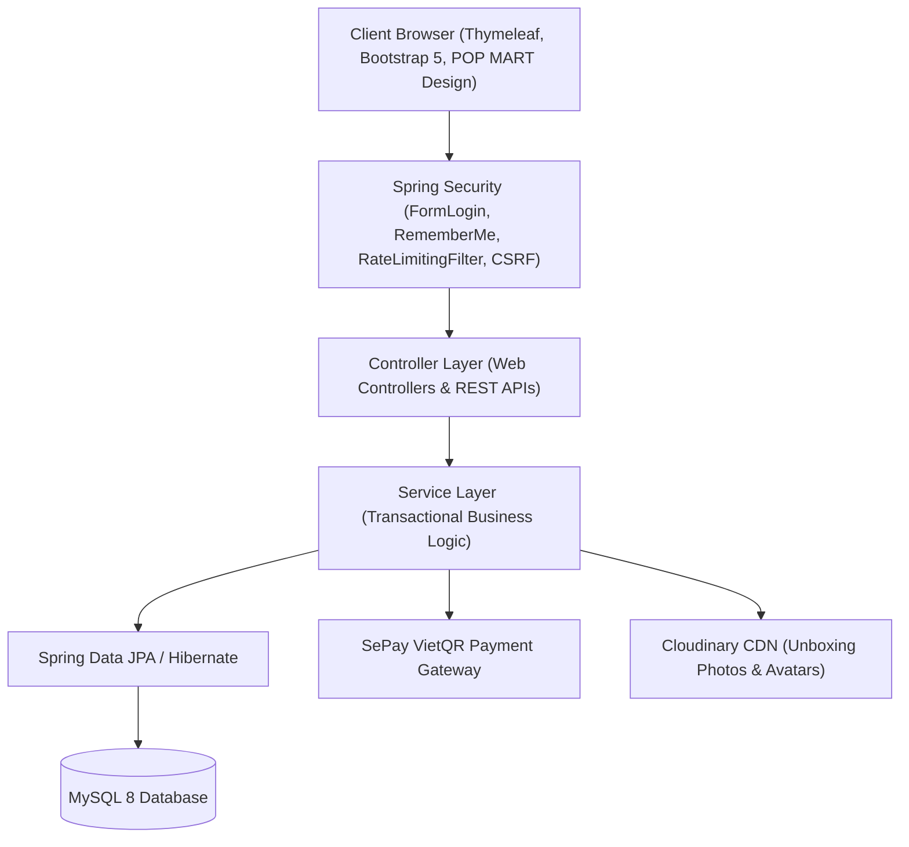

# 🧸 PopWorld - Nền Tảng Thương Mại Điện Tử & Bốc Hộp Ảo Blind Box Nghệ Thuật (POP MART Style)

> **Đồ Án Tốt Nghiệp / Graduation Project**  
> **Công nghệ:** Java 21 | Spring Boot 3.x | Spring Security | MySQL 8 | Thymeleaf | SePay VietQR | Cloudinary | Bootstrap 5  
> **Kiểm thử tự động:** 500+ Automated Unit & Integration Tests (100% Green Build)

---

## 📌 1. Giới Thiệu Đề Tài (Project Overview)

**PopWorld** là hệ thống thương mại điện tử chuyên biệt dành cho thị trường mô hình nghệ thuật **Art Toy** và hộp mù **Blind Box**, được phát triển dựa trên ngôn ngữ thiết kế tối giản hiện đại chuẩn quốc tế của **POP MART** (Màu đen Obsidian Black `#000000`, sắc đỏ Pop Red `#D2001E`, hình khối sắc nét và kiểu chữ Barlow đặc trưng).

Bên cạnh các nghiệp vụ thương mại điện tử hoàn chỉnh (giỏ hàng, đặt hàng, sổ địa chỉ hành chính 2 cấp hiện đại, thanh toán VietQR tự động qua SePay webhook, theo dõi vận đơn), dự án sở hữu tính năng đột phá độc quyền **POP NOW** — mô phỏng chân thực trải nghiệm bốc hộp mù trực tuyến:
* Giữ hộp thời gian thực (TTL 5 phút) với cơ chế khóa bi quan (Pessimistic Locking) chống tranh chấp.
* Tủ trưng bày ảo (**Virtual Cabinet**) lưu trữ mô hình sau khi mở hộp, cho phép gom nhiều hộp lại để yêu cầu đóng gói ship 1 lần.
* Thẻ gợi ý (**Hint Cards**) và tỷ lệ xuất hiện nhân vật hiếm (**Secret Ratio: 1/144**) minh bạch, công bằng.

---

## 🏗️ 2. Kiến Trúc & Công Nghệ Sử Dụng (Architecture & Tech Stack)



* **Backend Framework:** Java 21 LTS, Spring Boot 3.x, Spring Data JPA, Spring Security 6.
* **Database & Caching:** MySQL 8.0, Transaction Management, Pessimistic Locking.
* **Frontend UI/UX:** Thymeleaf SSR, Bootstrap 5.3, Bootstrap Icons, POP MART Custom Theme CSS, Barlow Typography.
* **Tích Hợp Bên Thứ Ba:**
  * **Cổng thanh toán SePay:** Quét mã VietQR động, Webhook bảo mật API-Key tự động kích hoạt đơn hàng trong 1-2 giây.
  * **Cloudinary Cloud Storage:** Tải ảnh đại diện, ảnh unboxing bóc hộp của khách hàng và tối ưu hóa CDN.
* **Testing & Quality Assurance:** JUnit 5, Mockito, Spring Boot Test (500+ tests tự động chạy thành công).

---

## ✨ 3. Tính Năng Cốt Lõi (Key Features)

### 🛒 A. Phân Hệ Khách Hàng (Customer Storefront)
1. **Trang Chủ & Danh Mục Sản Phẩm:**
   * Banner nghệ thuật, bộ sưu tập Hot Drops, Best Sellers, Top Nhân Vật (Labubu, Skullpanda, Crybaby, Molly, Dimoo).
   * Bộ lọc đa năng theo Danh mục, Series IP, Khoảng giá và Sắp xếp thông minh.
2. **Chi Tiết Sản Phẩm & Đánh Giá:**
   * Hỗ trợ chọn mua hộp lẻ (**Single Box**) hoặc nguyên thùng (**Whole Set**).
   * Khu vực đánh giá Unboxing thực tế kèm ảnh/video tải trực tiếp từ người mua.
3. **Giỏ Hàng & Thanh Toán Chuẩn Hành Chính Mới:**
   * Cập nhật số lượng tức thì, áp dụng Voucher giảm giá sàn và mã Freeship.
   * **Sổ địa chỉ hành chính 2 cấp hiện đại:** Tỉnh/Thành phố & Xã/Phường/Thị trấn (Lưu trực tiếp, không phụ thuộc mã bên ngoài).
   * Thanh toán chuyển khoản tự động quét mã VietQR qua SePay và thanh toán COD khi nhận hàng.
4. **Trung Tâm Hội Viên (Account Hub):**
   * Quản lý hồ sơ cá nhân, đổi mật khẩu, danh bạ sổ địa chỉ nhiều nơi nhận.
   * Lịch sử đơn hàng, hủy đơn hàng trực tiếp khi còn ở trạng thái `TO_PAY` hoặc `PROCESSING`.
   * Hệ thống điểm thưởng **POP Points**, check-in hàng ngày, đổi voucher độc quyền.
5. **Tra Cứu Đơn Hàng Nhanh (`/order-tracking`):**
   * Khách vãng lai tra cứu lộ trình vận đơn bằng Mã đơn hàng + Số điện thoại nhận hàng không cần đăng nhập.
6. **Hỗ Trợ Khách Hàng Form Tai Nghe (Floating Support Modal):**
   * Nút tai nghe cố định trên header cho phép khách gửi yêu cầu/khiếu nại tức thì vào Admin.

### ⚡ B. Tính Năng Độc Quyền POP NOW (Virtual Unboxing)
1. **Bốc Hộp Ảo Trực Tuyến:** Chọn hộp trên bàn cờ ảo, hiển thị hộp 3D hồi hộp.
2. **Cơ Chế Giữ Hộp (Reservation Hold):** Giữ hộp 5 phút cho khách thanh toán, tự động giải phóng nếu hết giờ.
3. **Tủ Đồ Ảo (Virtual Cabinet):** Sau khi bóc hộp, mô hình được lưu trong tủ ảo của tài khoản. Khách có thể giữ lại tích lũy hoặc bấm "Yêu Cầu Giao Hàng" để đóng kiện gửi về tận nhà.
4. **Thẻ Gợi Ý & Tỷ Lệ Secret:** Sử dụng Hint Cards để loại trừ các mẫu nhân vật không mong muốn.

### 🛠️ C. Hệ Thống Quản Trị Toàn Diện (Admin Portal - `/admin`)
1. **Bảng Điều Khiển Tổng Quan (Dashboard):** 4 thẻ KPI tài chính, doanh thu thời gian thực, biểu đồ đơn hàng.
2. **Quản Lý Đơn Hàng & Vận Chuyển (`/admin/orders`):**
   * Quản lý chuyển trạng thái: `Chờ thanh toán` → `Đang đóng gói` → `Đã giao ĐVVC` → `Giao thành công`.
   * Hủy đơn hàng và Hoàn tiền linh hoạt (Hoàn tiền một phần hoặc toàn phần).
3. **Kho Hàng Art Toy (`/admin/products`):**
   * Giao diện 2 tầng chuẩn POP MART, không tràn ngang, tên mô hình hiển thị 2 dòng rõ ràng.
   * Cập nhật tồn kho nhanh inline, tải ảnh sản phẩm, ẩn/hiện, xóa an toàn (Soft delete).
4. **Kiểm Soát Tồn Kho & Cảnh Báo Động (`/admin/inventory`):**
   * Thống kê cạn kho, sắp hết hàng, giá trị tồn kho.
   * **Điều chỉnh / Kiểm kê tồn kho thực tế:** Cho phép nhập trực tiếp số lượng tồn mới và chuyển sản phẩm sang `SẮP HẾT HÀNG` (≤ ngưỡng cảnh báo) hoặc `HẾT HÀNG`.
   * Cấu hình linh hoạt **Ngưỡng cảnh báo sắp hết** (≤5, ≤10, ≤15, ≤20 hộp).
5. **Báo Cáo Doanh Thu & Tài Chính (`/admin/reports`):**
   * Phân bổ dòng tiền SePay VietQR vs Tiền mặt COD, Top mô hình bán chạy nhất.
   * Bảng kê doanh thu cuộn 10 ngày gần nhất với thanh cuộn tối ưu UX và dòng tổng kết cố định.
6. **Quản Lý Khuyến Mãi / Voucher (`/admin/coupons`):**
   * Tạo mã voucher (% hoặc tiền cố định), ngày bắt đầu/kết thúc, giới hạn lượt dùng, bật/tắt.
7. **Hỗ Trợ & Phản Hồi Khách Hàng (`/admin/support`):**
   * Tiếp nhận các phiếu khiếu nại từ form tai nghe, cập nhật trạng thái `ĐÃ XỬ LÝ` và lưu ghi chú liên hệ.
8. **Quản Lý Khách Hàng & VIP (`/admin/customers`):**
   * Danh sách khách hàng, thống kê tổng chi tiêu, phân hạng thành viên Member / VIP.
9. **Kiểm Duyệt Đánh Giá (`/admin/reviews`):**
   * Duyệt hoặc ẩn đánh giá unboxing công khai của người dùng.
10. **Cấu Hình POP NOW (`/admin/popnow`):**
    * Cấu hình danh sách series mở bán online, xác suất trúng nhân vật đặc biệt (Secret Ratio).

---

## 🚀 4. Hướng Dẫn Cài Đặt & Khởi Chạy (Quick Start)

### Yêu Cầu Môi Trường
* **JDK 21** trở lên (Khuyến nghị Eclipse Temurin JDK 21 hoặc 25).
* **Docker & Docker Compose** (để chạy MySQL 8).
* **Maven 3.9+** (hoặc dùng sẵn `./mvnw` đi kèm dự án).

### Bước 1: Khởi động CSDL MySQL bằng Docker
Mở terminal tại thư mục gốc dự án và chạy:
```bash
docker-compose up -d
```
*Lưu ý: MySQL sẽ khởi chạy trên port `3306`, database `popworld_db`, username `root`, password `admin123`.*

### Bước 2: Khởi động ứng dụng Spring Boot
```bash
# Trên Windows (PowerShell / CMD)
cmd /c "set JAVA_HOME=C:\Users\hopl2\.jdks\temurin-25.0.3&& mvnw.cmd spring-boot:run"

# Trên Linux / macOS
./mvnw spring-boot:run
```

### Bước 3: Truy cập hệ thống
* **Giao diện Cửa Hàng (Client):** `http://localhost:8080/`
* **Giao diện Quản Trị (Admin):** `http://localhost:8080/admin`
* **Tra cứu vận đơn (Guest Tracking):** `http://localhost:8080/order-tracking`

---

## 🔑 5. Danh Sách Tài Khoản Demo (Demo Credentials)

> Trên trang đăng nhập (`http://localhost:8080/login`), hệ thống đã tích hợp sẵn **Cụm Nút 1-Click Điền Tài Khoản Demo** để Hội đồng và Giảng viên trải nghiệm ngay tức thì:

| Loại Tài Khoản | Email | Mật Khẩu | Quyền Hạn / Vai Trò |
| :--- | :--- | :--- | :--- |
| **Quản Trị Viên (Admin)** | `admin@popworld.com` | `admin123` | Toàn quyền quản trị Dashboard, Orders, Inventory, Reports, Coupons, Support |
| **Khách Hàng Thường** | `user@popworld.com` | `user123` | Đặt hàng, giỏ hàng, tra cứu lịch sử, bốc hộp POP NOW, tích điểm |
| **Khách Hàng VIP** | `collector@popworld.com` | `admin123` | Tài khoản VIP sở hữu 9.999 POP Points, nhiều đơn hàng và địa chỉ mẫu |

---

## 🧪 6. Chạy Toàn Bộ Kiểm Thử Tự Động (Run Test Suite)

Dự án tuân thủ nghiêm ngặt quy trình phát triển phần mềm chất lượng cao với **500+ test cases** phủ rộng các tầng Unit & Integration:

```bash
./mvnw test
```
**Kết quả đầu ra kỳ vọng:**
```
[INFO] Tests run: 500, Failures: 0, Errors: 0, Skipped: 1
[INFO] BUILD SUCCESS
```

---

## 📋 7. Kịch Bản Thuyết Trình Bảo Vệ Đồ Án (5-Step Defense Script)

1. **Bước 1 - Khách Hàng Mua Sắm:** Truy cập trang chủ, xem bộ sưu tập Blind Box, xem chi tiết mô hình Labubu, chọn mua hộp lẻ hoặc nguyên set, thêm vào giỏ hàng.
2. **Bước 2 - Đột Phá Bốc Hộp POP NOW:** Vào menu POP NOW, bốc hộp ảo, trải nghiệm đếm ngược giữ hộp 5 phút, mở xem nhân vật trúng, cất vào Tủ ảo Virtual Cabinet.
3. **Bước 3 - Đặt Hàng & Thanh Toán VietQR Tự Động:** Vào Checkout, chọn địa chỉ hành chính 2 cấp mới (Hà Nội → Phường Hàng Trống), chọn thanh toán SePay QR, quét mã thanh toán, đơn hàng tự động chuyển sang `PROCESSING`.
4. **Bước 4 - Tra Cứu Vận Đơn Khách Vãng Lai:** Truy cập `/order-tracking`, nhập mã đơn hàng và SĐT nhận hàng, theo dõi tiến trình vận đơn trực quan.
5. **Bước 5 - Quản Trị Viên Xử Lý Đơn & Kho Hàng:** Đăng nhập Admin qua nút 1-Click:
   * Vào **Kho hàng Art Toy** (`/admin/products`): Sửa nhanh tồn kho inline.
   * Vào **Kiểm soát tồn kho** (`/admin/inventory`): Dùng modal Điều chỉnh đưa tồn kho về mức 5, kích hoạt trạng thái `SẮP HẾT HÀNG`.
   * Vào **Báo cáo doanh thu** (`/admin/reports`): Xem biểu đồ phân bổ SePay vs COD và bảng cuộn 10 ngày.
   * Vào **Khuyến mãi** (`/admin/coupons`): Tạo mã giảm giá mới `POPVIP2026`.
   * Vào **Hỗ trợ** (`/admin/support`): Xử lý phản hồi từ form tai nghe của khách hàng.

---

## 📄 8. Bản Quyền & Giấy Phép
Dự án được thực hiện phục vụ mục đích học tập và bảo vệ đồ án tốt nghiệp ngành Công Nghệ Thông Tin.  
Bản quyền thuộc về nhóm phát triển **PopWorld Team**.
